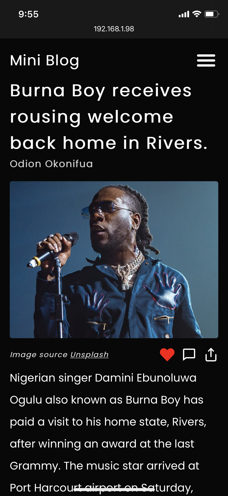
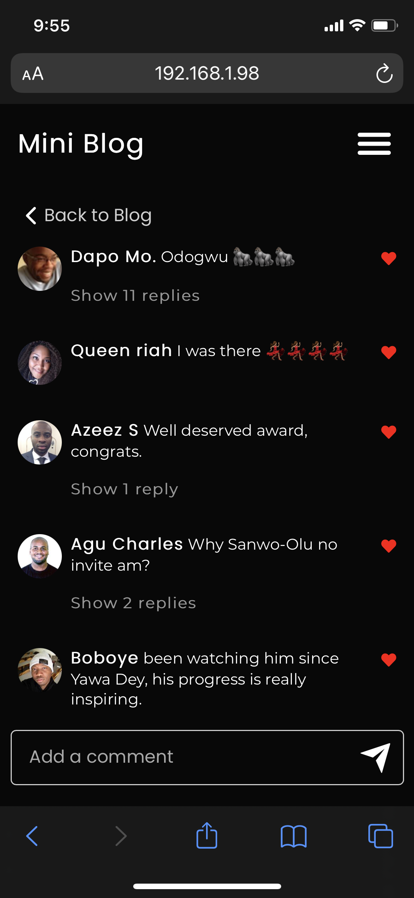
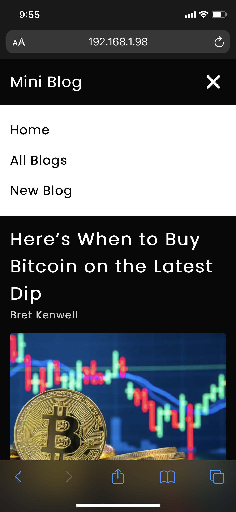
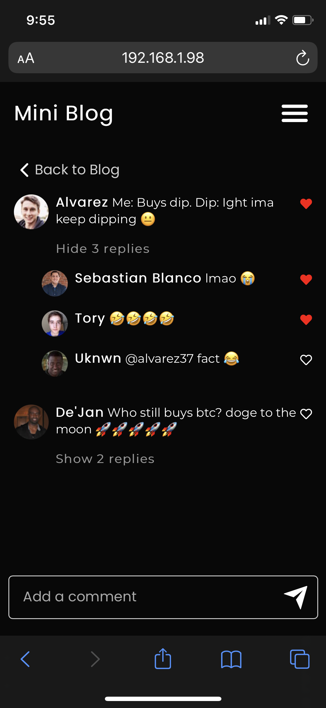
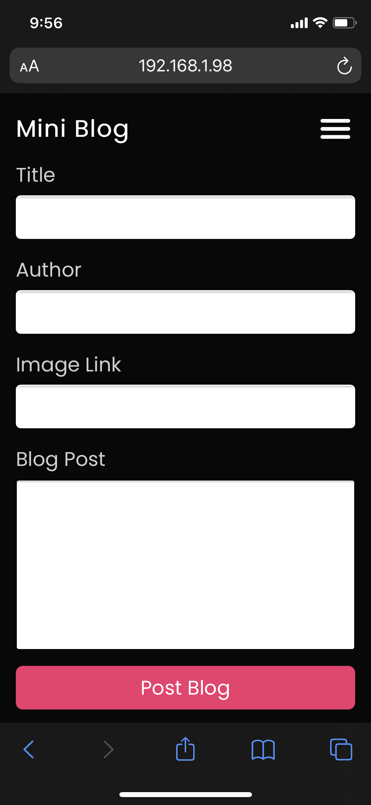

# Mini Blog
A lightweight blogging website built with react. 

# 1
run `npm install` to install the dependencies

# 2 
run `npm start` to start the app

# 3
run `npm run server` to start the db.json server

# Some images.

# I DO NOT OWN RIGHTS TO ANY OF THE BLOG CONTENTS USED
